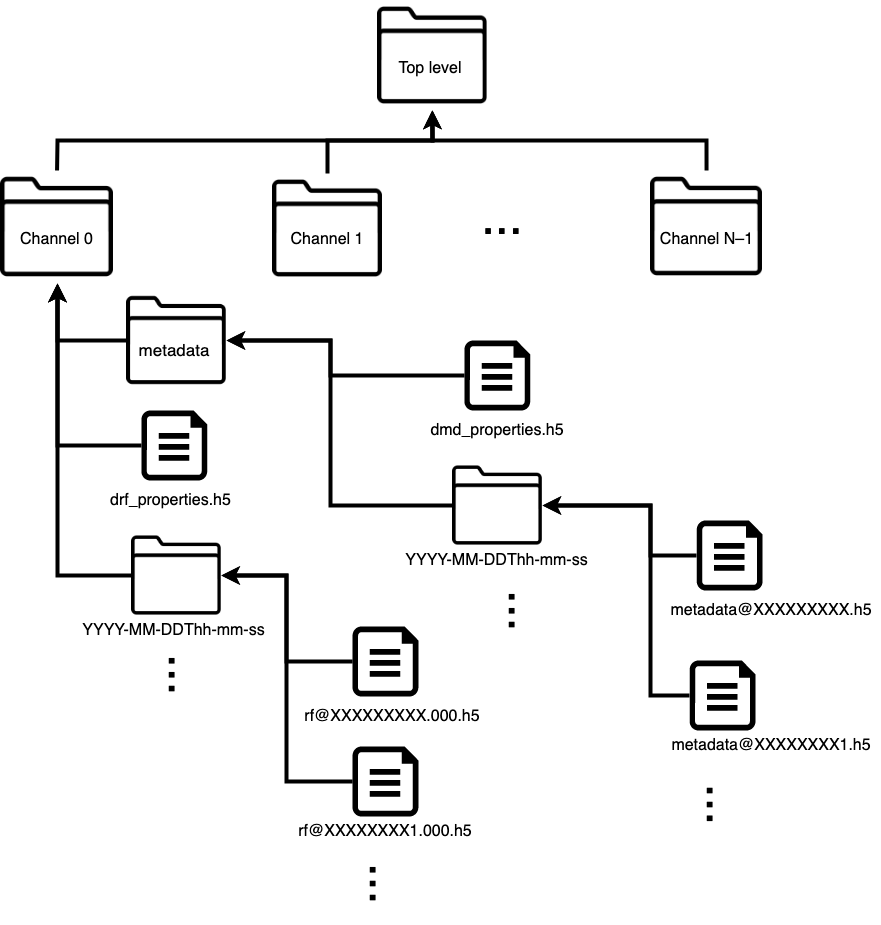

# Digital RF
The draft app-note for Digital RF

## Abstract

This application note details the open source package Digital RF. This software product contains tools to use the formats Digital RF and Digital Metadata which can be used store RF voltage data and its associated metadata. This note will show how to install Digital RF from source. After which some examples will be showed.

## Format
A diagram of the file format is shown in the figure below. Each data set starts with a top level directory. The sub directories are labeled as "channels" which have folders labeled as metadata, an h5 file named drf\_properties.h5 folders with the data and time that the data was taken. In order to clarify for the rest of the document we will refer to this structure as a Digital RF Channel.

Within each Digital RF Channel directory the drf\_properites.h5 a metadata directory and a set of directories with time tags for names. The drf\_properties.h5 file holds information on the RF data such as sampling rate, and numerical type. The metadata directory is similar to the channel directory: a properties file, dmd\_properties.h5, which holds basic information on the metadata e.g. sampling rate; and a series of time tagged folders holding the h5 files containing the metadata. Each time tagged directory is a series of h5 files titled using a posix time stamp that hold the RF data. The h5 files hold the rf data in arrays of size M samples by N Digital RF Sub-channels. The concept of a Digital RF Sub-channel is similar to the Digital RF Channel but can simplify data reading so that data streams that will be processed together, and have the same sampling rate, can easily be pulled into memory together. The Digital RF Sub-channels are labelled, by default, numerically like a Python list. The user can save with in the Digital Metadata identifying information for the Digital RF Sub-channels.

The format has some distinctive aspects. The labeling convention for samples uses the unix epoch but instead of number of seconds, it uses number of samples, i.e. sample rate multiplied the time stamp in seconds. This allows for all samples to be labelled with an integer number. The sampling rate is also stored as a ratio of two integers, thus avoiding any round off issues.

## Install Instructions

Digital RF can be installed through a number of different package managers. For a full list and instructions see the README on the [Digital RF GitHub page](https://github.com/MITHaystack/digital_rf).

In this note we will focus on installing Digital RF from source on Ubuntu 20.04. We will be targeting UHD 4.0.0 and GNURadio 3.8. Instructions to install these packages are shown in this [application note](https://kb.ettus.com/Building_and_Installing_the_USRP_Open-Source_Toolchain_(UHD_and_GNU_Radio)_on_Linux). After the UHD and GNU Radio installs a few more applications need to be installed. These can be installed through apt-get on the Ubuntu system:

~~~bash
sudo apt install python3-pip
pip3 install sounddevice
sudo apt install libhdf5-dev python3-pkgconfig python3-setuptools python3-h5py \
python3-packaging python3-dateutil python3-tz python3-uhd python3-matplotlib \
python3-pandas python3-pandas python3-watchdog
~~~

To start the install clone the repository, enter the source directory and create a build directory to keep the source tree clean:

~~~bash
git clone https://github.com/MITHaystack/digital_rf.git
cd digital_rf
mkdir build
cd build
~~~
Build and install:

~~~bash
cmake -DPython_EXECUTABLE=/usr/bin/python3 ../
make
make test
sudo make install
~~~

CMake will attempt to find your Python installation in the usual places, preferring Python 3. If this fails or you need to specify a Python 2 installation (e.g. for GNU Radio older than version 3.8), specify a particular Python interpreter by adding ``-DPython_EXECUTABLE={PATH}`` (replacing ``{PATH}`` with the interpreter path) to the cmake command.

Finally, you may need to update the library cache so the newly-installed ``libdigital_rf`` is found:

~~~bash
sudo ldconfig
~~~

Note that it is also possible to build the different language libraries separately by following the CMake build procedure from within the `c`, `matlab`, and `python` directories.

## Example Usage

The Digital RF and Digital Metadata formats have a Python API that can be used to access the data. The software creates a reader object for the entire data sets. The user then specifies a Digital RF Channel and number of samples they desire which are then output in an area. When the user reads a piece of data they will get an array where the first dimension is the number of samples while the second dimension is the number of Digital RF Sub-channels, unless they specify the Sub-channel number in the read call.

Python and C examples can be found in the examples directory in the source tree. The C examples can be compiled from the build directory by running::

~~~bash
make examples
~~~

The following Python commands will load and read data located in a directory "/data/test".

Load the module and create a reader object

~~~python
import digital_rf as drf
do = drf.DigitalRFReader('/data/test')
~~~

List channels:

~~~python
do.get_channels()
~~~
Get data bounds for channel 'cha':

~~~python
s, e = do.get_bounds('cha')
~~~
Read first 10 samples from channel 'cha':

~~~python
data = do.read_vector(s, 10, 'cha')
~~~

## Basic Recording and Transmitting with USRPs

## Example 2

We have another example.
